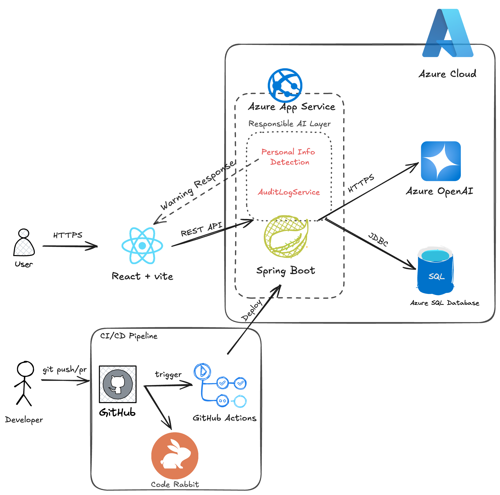

# TroubleLog-server

개발자가 프로젝트 코드와 구현 의도를 등록하면, AI가 기술 면접 질문을 생성하고 답변 피드백과 역량 분석을 제공하는 백엔드 서버입니다.

## 주요 기능

- 프로젝트 코드 및 사전 컨텍스트 등록
- Azure OpenAI 기반 면접 질문 생성
- 질문별 답변 AI 피드백 제공
- 최종 답변 제출 전 개인정보/민감정보 감지
- 면접 리포트 및 역량 레이더 생성을 위한 프롬프트 관리

## 프로젝트 아키텍처

## 개발 환경

- Java 21
- Spring Boot 3.5.14

## 면접 답변 흐름

1. 사용자가 프로젝트 코드와 사전 컨텍스트를 등록합니다.
2. 서버가 프로젝트 맥락에 맞는 면접 질문 3개를 생성합니다.
3. 사용자는 각 질문에 답변하면서 필요할 때 AI 피드백을 받을 수 있습니다.
4. 최종 제출 시 서버가 답변 3개를 저장하고 개인정보 포함 여부를 확인합니다.
5. 개인정보가 없으면 리포트 생성 단계로 이어집니다.

## 책임 있는 AI

- AI 호출 시작, 성공, 실패 이력을 감사 로그로 기록합니다.
- 최종 답변 제출 시 개인정보와 민감정보 포함 여부를 검사합니다.
- 이메일, 전화번호, 주민등록번호, 카드번호, 비밀번호, API Key, DB 비밀번호로 보이는 값을 감지합니다.
- 개인정보 또는 민감정보가 감지되면 리포트 생성을 진행하지 않고 프론트에 경고 정보를 반환합니다.
